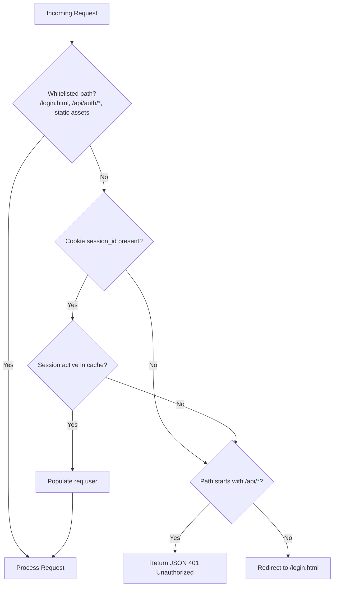
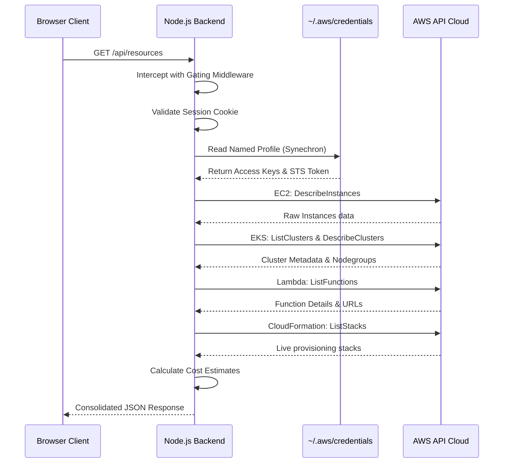

# System Architecture and Information Flow

This document details the architecture design, information flow, data acquisition routes, and design decisions of the AWS Status Dashboard.

## High-Level Architecture Design

Due to browser security sandboxing, client-side code running in a browser cannot read local system files (such as `~/.aws/credentials`) or make direct TCP calls to AWS endpoints without triggering CORS violations. 

To bridge this gap securely, the portal implements a hybrid proxy model:

1. **Backend Proxy (Node.js)**: Runs locally on the developer machine or in a container, authenticating against the AWS API using named profile credentials.
2. **Frontend UI (HTML/JS)**: Fetches aggregated metrics from the backend proxy and renders them in a glassmorphic dashboard interface.
3. **WebMCP Layer**: Declares WebMCP tools on the client browser context (`navigator.modelContext.registerTool`) so browser-based AI agents can query the live status of the developer environment.
4. **Model Context Protocol Server**: Runs a parallel stdio-based service (`mcp_server.js`) allowing desktop AI tools (like Claude Desktop) to invoke actions in the environment.

---

## Authentication and Decision Flow

Every request to the backend proxy is evaluated by gating middleware to enforce authentication rules before querying AWS resources. The flow of decisions is detailed below:

### Authentication Logic
- **AWS SSO Verification**: Validates whether the local `Synechron` profile credentials are active by executing `aws sts get-caller-identity`. If valid, it establishes a user session.
- **SSO Refresh**: If verification fails, the portal triggers `aws sso login` to launch the browser authentication flow on the host.
- **GitHub and GitLab OAuth**: Integrates standard OAuth authorization code grant flows using Client IDs and Client Secrets configured via the platform's settings.

---

## Data Acquisition and Resource Flow

The portal consolidates information from multiple sources to provide a unified operations view. The diagram below illustrates how data is requested, retrieved, and processed:

### Data Sources and Mappings

| Resource Type | Retrieval Mechanism | AWS API Call | Output Fields Map |
| :--- | :--- | :--- | :--- |
| **EC2 Instances** | AWS SDK (`EC2Client`) | `DescribeInstancesCommand` | ID, Name, State, Type, IP, Region, Launch Time |
| **EKS Clusters** | AWS SDK (`EKSClient`) | `ListClustersCommand` / `DescribeClusterCommand` | Cluster Name, Version, Status, Endpoint, Node Groups |
| **Lambda Functions** | AWS SDK (`LambdaClient`) | `ListFunctionsCommand` | Function Name, Runtime, Memory, Timeout, Last Modified |
| **CloudFormation** | AWS SDK (`CloudFormationClient`) | `ListStacksCommand` | Stack Name, Status, Creation Time, Description |
| **CloudTrail Logins** | AWS SDK (`CloudTrailClient`) | `LookupEventsCommand` (EventName: `ConsoleLogin`) | Username, User Type, Timestamp, Source IP, Status |
| **Cost Explorer** | AWS SDK (`CostExplorerClient`) | `GetCostAndUsageCommand` | Month-to-date actual costs, currency unit |
| **AWS Budgets** | AWS SDK (`BudgetsClient`) | `DescribeBudgetsCommand` | Budget Limit, Calculated Spent, Budget Name |

---

## Design Rationale

### 1. fromIni Credentials Resolution
The backend is initialized using the `fromIni` credential provider rather than hardcoded environment variables. This allows the Node SDK to read from the system's `~/.aws/credentials` file dynamically on every AWS client call. When credentials expire and are renewed (either via CLI or via the portal's SSO refresh button), the backend immediately adopts the new credentials without requiring a server restart.

### 2. File-Backed Session Store
To ensure developer sessions survive application restarts (e.g. when changing configuration files), sessions are serialized to `.sessions.json`. Sessions older than 12 hours are purged dynamically on load and save, ensuring data hygiene and security.

### 3. Decoupled Demo Mode
For testing environments (e.g. deployment to static GitHub Pages), the client-side JavaScript intercepts `window.fetch`. When local hosting is detected, it returns structured mock JSON matching the format of the backend API, allowing full functionality of the dashboard's layout and components without an active AWS connection.
